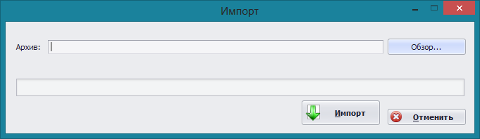
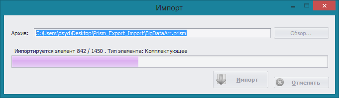


## Импорт данных
Для переноса данных между рабочими станциями необходимо воспользоваться службой экспорта импорта.
###	Загрузка данных
Для загрузки пакета данных в программу необходимо в меню **Файл** и выбрать пункт **Импорт**

С помощью кнопки **Обзор...** выбрать файл архива и нажать кнопку **Импорт**
Следить за процессом импорта данных можно с помощью элемента прогресса который отображает текущее состояние импорта.

