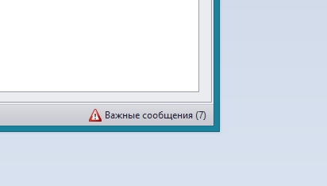


### Важные сообщения

На главном окне программы правом нижнем углу размещена кнопка **Важные сообщения** на которой отображается общее количество сообщений. По нажатию на эту кнопку открывается форма, содержащая список сообщений.

В первом столбце отображается статус сообщения (предупреждение в случае приближения конкретного события или критическое сообщение, когда событие уже наступило)
Во втором и третьем столбце отображаются различные данные в зависимости от типа сообщения.
В четвертом столбце указывается текст сообщения. 

