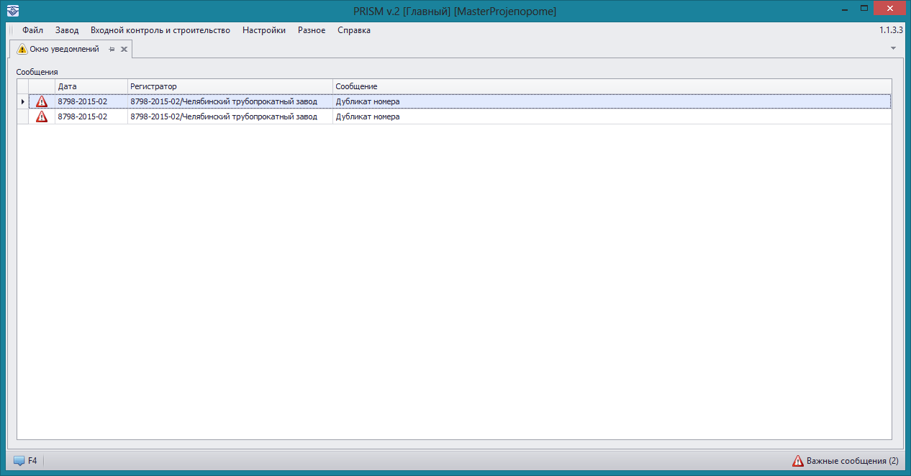


### Сообщение о дублировании номера трубы 

Данный тип сообщений появляется в случае, когда у нескольких труб совпадают номера. В списке сообщений будут отображены все трубы имеющие одинаковые номера. 

Для данного типа сообщений в общем списке во втором и третьем столбцах отображается дублирующийся номер трубы.

По двойному нажатию на такое сообщение программа откроет трубу с таким номером. 

