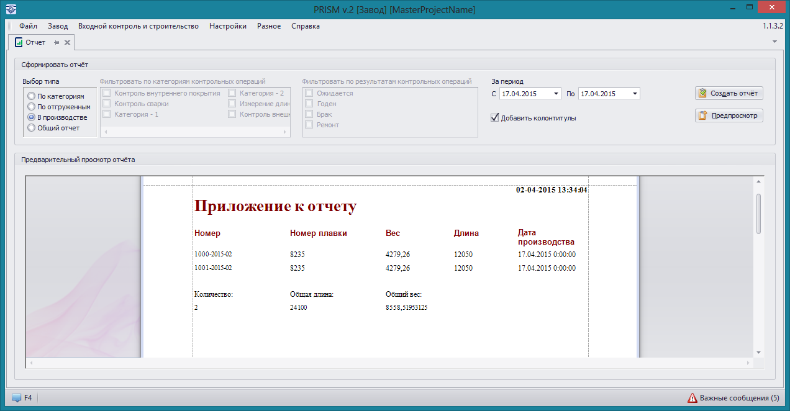

### Приложение к отчету

Для создания данного отчета необходимо выбрать тип отчета **В производстве**
 и указать период для ограничения даты производства труб.
 
В этом отчете отображается номер трубы, номер плавки, вес, длина и дата производства уже выпущенных труб, у которых дата производства попадает в заданный диапазон. 

Так же в этом отчете предоставлена общая информация по произведенным трубам: количество, длина и вес всех произведенных труб.

