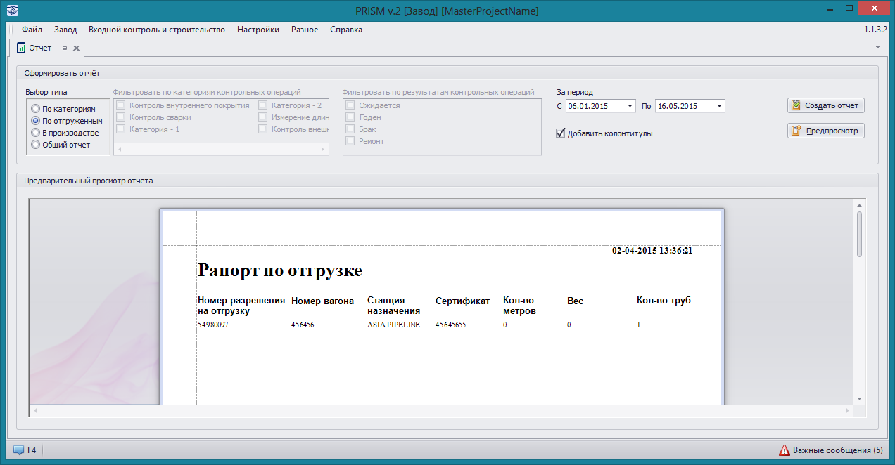

### Рапорт по отгрузке

Для создания данного отчета необходимо выбрать тип отчета **По отгруженным**
 и указать период для ограничения даты отгрузки.
 
Отображаемая информация: номер разрешения на отгрузку, номер вагона, станция назначения, сертификат, общее количество метров и вес труб в вагонах. 

