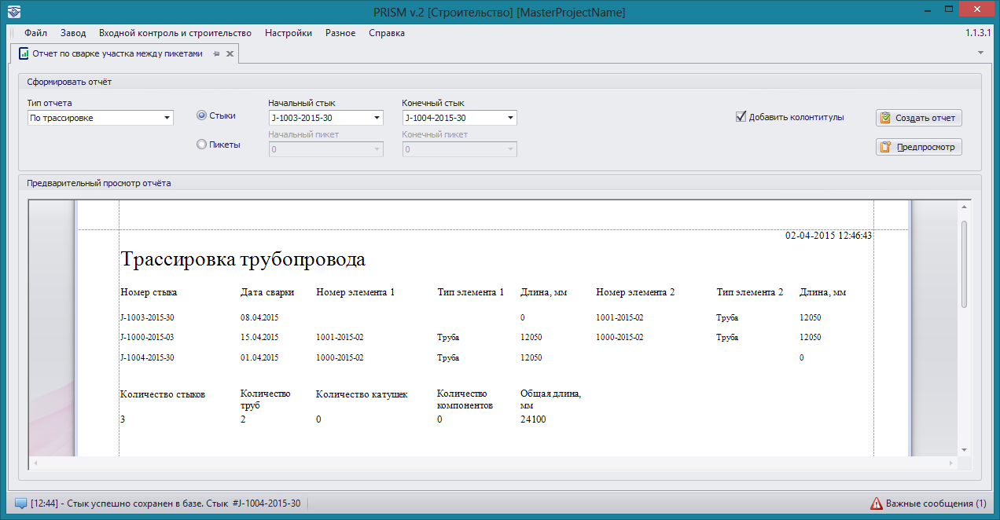

### Трассировка

Отчет типа **Трассировка трубопровода** предназначен для вывода информации о поэлементном соединении компонентов трубопровода между двумя заданными стыками или номерами пикетов. Доступ к данному типу отчета можно получить через пункты меню **Входной контроль и строительство -> Отчет по сварке участка между пикетами** при типах рабочих станций **Мастер** и **Строительство**. 

Для формирования отчета необходимо установить тип отчета **По трассировке** и задать начальный и конечный стык (или пикет) трассируемого