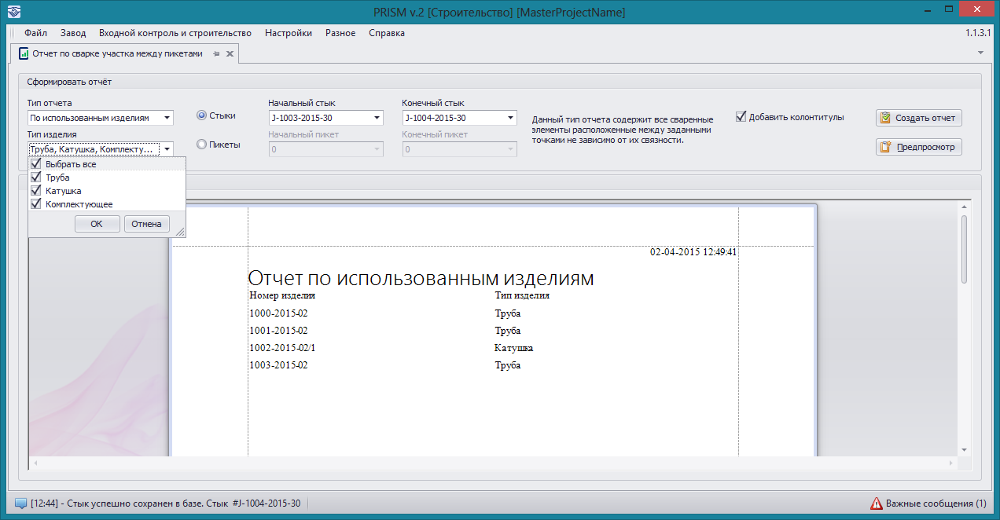

### Отчет по использованным изделиям 

Доступ к формированию данного отчета можно получить через пункты меню **Входной контроль и строительство -> Отчет по сварке участка между пикетами** при типах рабочих станций **Мастер** или **Строительство**, тип отчета должен быть установлен **По использованным изделиям**. В данный отчет попадают все сваренные элементы расположенные между заданными точками трубопровода вне зависимости от их связности. 

Для формирования отчета необходимо установить начальный и конечный стык (или пикет) участка трубопровода. Созданный отчет состоит из списка элементов, их номеров и типов. Отчет можно формировать только по заданной группе типов элементов, например, только по трубам либо только по комплектующим и катушкам. Данные полученные в результате создания отчета могут быть экспортированы в форматы **.xls** и **.xlsx**.