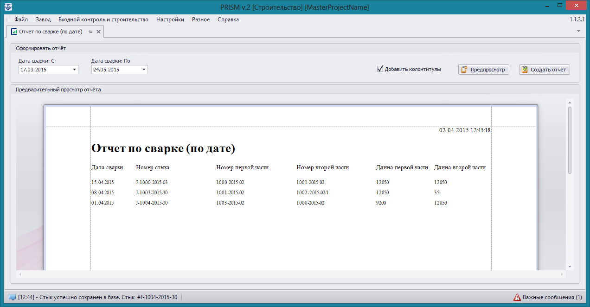

### Отчет по сварке за период 

На форму создания **Отчета по сварке за период** можно попасть через пункты меню **Входной контроль и строительство -> Отчет по сварке (по дате)**, данный отчет доступен при типе рабочей станции **Строительство**.

В данном отчете содержатся все стыки с датой сварки, находящейся в указанном диапазоне, оба элемента трубопровода, формирующие стык, а также их длины. На диапазон дат формирования стыка наложено ограничение: начальная дата должна быть меньше конечной. Пустой отчет свидетельствует об отсутствии стыков сформированных в указанный промежуток времени.