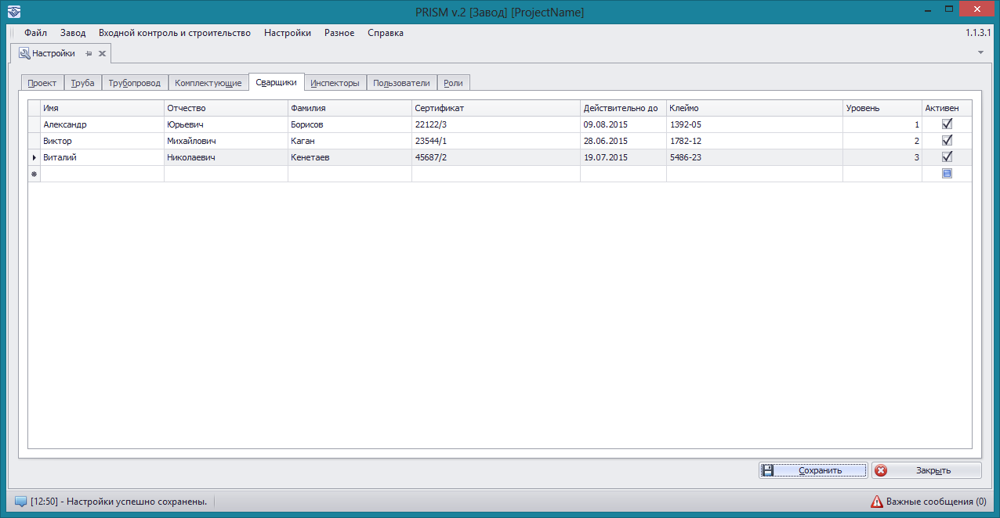
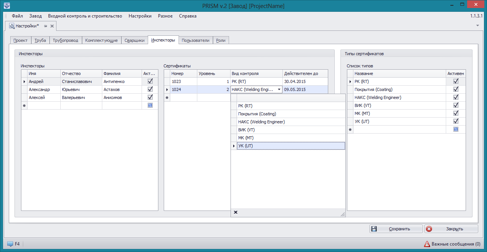


### Настройки сварщиков и инспекторов 

Доступ к этим настройкам можно получить выбрав пункты меню **Настройки->Сварщики** или **Настройки->Инспекторы** соответственно.
Добавление новой записи производится активацией пустой строки кликом мыши в свободной области таблицы. Редактирование существующих записей производится непосредственно в таблице.

На вкладке **Сварщики** отображается список всех сварщиков проекта. 

На вкладке **Инспекторы** производятся настройки инспекторов и типов сертификатов.

На вкладке **Инспекторы** в первой таблице указывается список инспекторов проекта, во второй таблице список сертификатов выделенного инспектора. На вкладке **Типы сертификатов** настраивается список сертификатов для инспекторов. 

